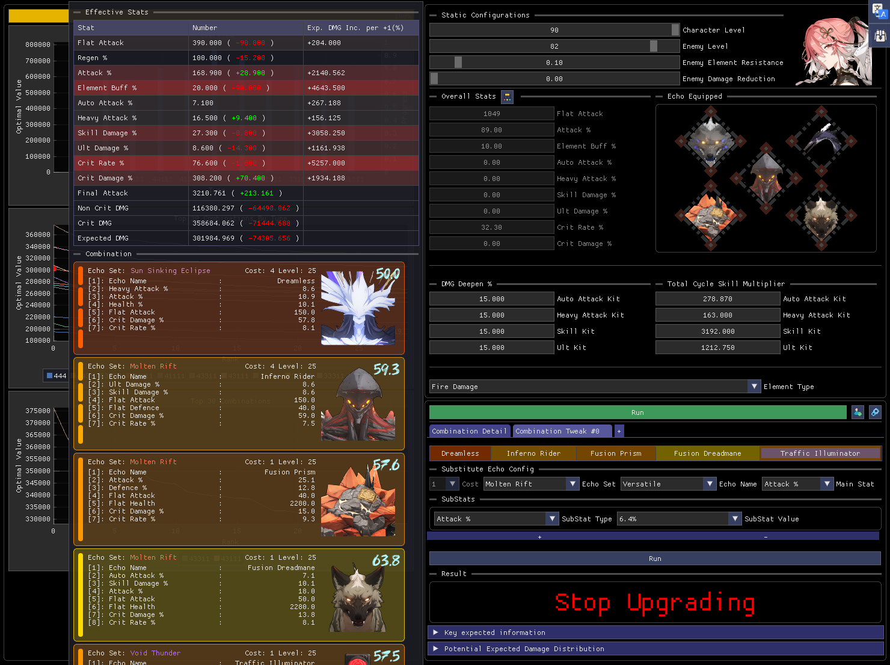
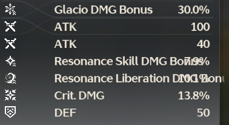
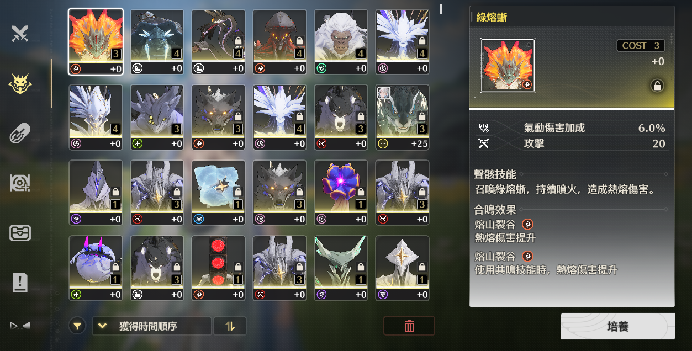
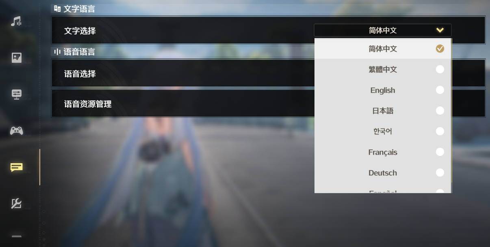

> ⚠️ This project is still under development
# Usage

## Echo Optimizer

### To launch

#### From command line with custom echo storage

```bash
WuWaOptim.exe "path to echoes.yaml"
```

See [echo file example](data/example_echos.yaml)

#### From File Explorer

As long as the scanner and the optimizer are located **in the same folder and you had ran the scanner**, you can start the optimizer by double-clicking on it in File Explorer

### To Use

See [Optimizer Usage](data/usage/opt_usage.md)

## Echo Scanner

1. Go to the echo page in you backpack (press b), scroll to the top
2. Run `WuWaScan.exe` as administrator as Wuthering Waves also runs as administrator
3. Enter the number of echoes to scan
4. Wait (You can terminate the scanning process with space bar)

> ⚠️Your Windows Display Scaling must be set to 100%\
> ⚠️Only support 1920x1080 in Simplified Chinese until Kuro fix this, or I have motivation to implementing echo scanning in character page\
> \
> Your echo page should look like the following **(4 by 6)**\
> 

> Simplified Chinese
> 

# Build from source

## Tools for compiling
- git
- cmake
- vcpkg
- Microsoft Visual C++
    - tested on 17.10.4

## Configuring
```bash
git clone https://github.com/EMCJava/WuWaOpt.git
cd WuWaOpt && mkdir build && cd build
```

Replace `PATH_TO_VCPKG` to the root directory of vcpkg
```bash
cmake -DCMAKE_TOOLCHAIN_FILE=PATH_TO_VCPKG/scripts/buildsystems/vcpkg.cmake ..
```

## Compiling & Running

### Echo Scanner

```bash
cmake --build . --target WuWaScan --config Release
cd .. && build\WuWaScan\Release\WuWaScan.exe
```

### Echo Optimizer
```bash
cmake --build . --target WuWaOptim --config Release
cd .. && build\WuWaOptim\Release\WuWaOptim.exe
```
